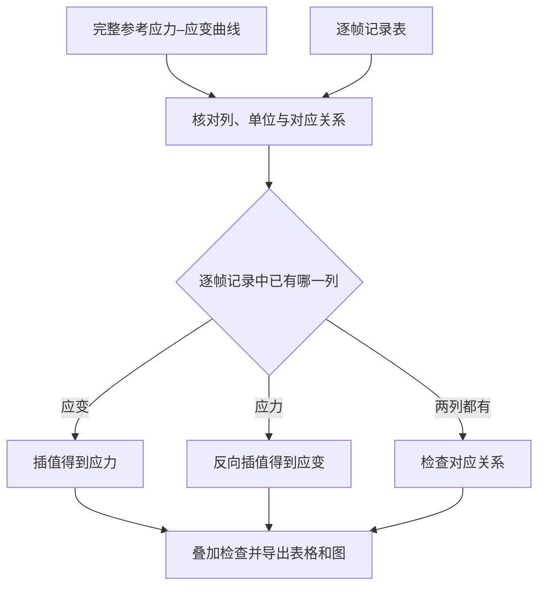

# StrainLink

**将逐帧衍射记录中的应力或应变，与完整参考应力–应变曲线对应起来。**

A Tk desktop tool for mapping frame-level stress or strain against a laboratory reference curve. It supports unit checks, overlay review, aligned tables, and plot export.

[安装与启动](#install--quick-start) · [数据映射步骤](#usage) · [输入条件](#features) · [图像应变工具 StrainTrace](https://github.com/D-sudoasd/StrainTrace)

[](LICENSE)



**每行代表一次谱线、帧或采集。** 对应结果是参考曲线的插值估计，不是从衍射峰重新测量应力或应变。使用前必须核对应变的小数/百分数及应力单位；反向映射还需确认所选参考区段的对应关系。

## Features

| Station has… | Mapper does… |
|--------------|--------------|
| Strain only | Interpolate → stress |
| Stress only | Inverse-interpolate → strain |
| Both | Units · alignment check · export |

- **PCHIP** shape-preserving interpolation when SciPy is available; otherwise linear fallback
- Optional Savitzky–Golay / smoothing guides (SciPy signal)
- Unit warnings (fraction vs percent strain; stress in MPa)
- High-contrast plotting and publication export presets
- Excel / CSV friendly table I/O via pandas + openpyxl

## Install / Quick start

Windows (double-click):

```text
start_stress_strain_mapper.bat
```

From source:

```powershell
pip install pandas numpy matplotlib scipy openpyxl
python sxrd_stress_strain_mapper_gui_v3.py
```

Requires Python 3 with **tkinter** (standard on most Windows / macOS Python installs).

## Usage

1. Load a **complete** lab reference σ–ε curve.
2. Load the beamline / station table (one row per frame).
3. Choose which column is missing (stress or strain) and confirm units.
4. Map → review overlay → export aligned table and plots.

## Scientific boundary — what it is NOT

- **Not** a constitutive material model, crystal plasticity solver, or FEM post-processor
- **Not** a DIC / virtual-extensometer strain extractor (see [StrainTrace](https://github.com/D-sudoasd/StrainTrace), formerly ezDIC, for image-based strain)
- Output quality **tracks the reference curve**; garbage in → garbage out
- Always verify **fraction vs percent** strain before publishing figures or tables

## Tests

```powershell
python -m unittest tests/test_stress_strain_mapper.py -v
```

## License

MIT — see [LICENSE](LICENSE).
