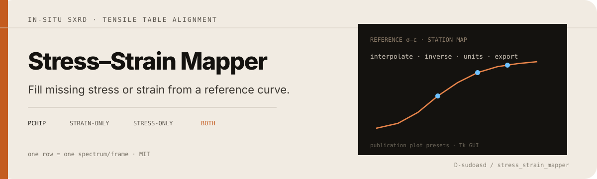

<p align="center">
  
</p>

# Stress–Strain Mapper

**Complete missing stress or strain for in-situ SXRD tensile tables using a reference curve.**

Desktop Tk GUI (v3). Each table row is one spectrum / frame / acquisition. A complete lab reference σ–ε curve fills the missing column, converts units, checks alignment, and exports plots.

<p align="center">
  
</p>

| Station has… | Mapper does… |
|--------------|--------------|
| Strain only | Interpolate → stress |
| Stress only | Inverse-interpolate → strain |
| Both | Units · check · export |

**PCHIP** when SciPy is available; otherwise linear. Optional smoothing guides. Publication export presets.

<p align="center">
  
</p>

```text
start_stress_strain_mapper.bat
```

```powershell
pip install pandas numpy matplotlib scipy openpyxl
python sxrd_stress_strain_mapper_gui_v3.py
```

Requires Python 3 with **tkinter**.

```powershell
python -m unittest tests/test_stress_strain_mapper.py -v
```

Limits: quality tracks the reference curve; not a constitutive model or DIC solver. Check fraction vs percent strain before publishing.

MIT — [LICENSE](LICENSE).
